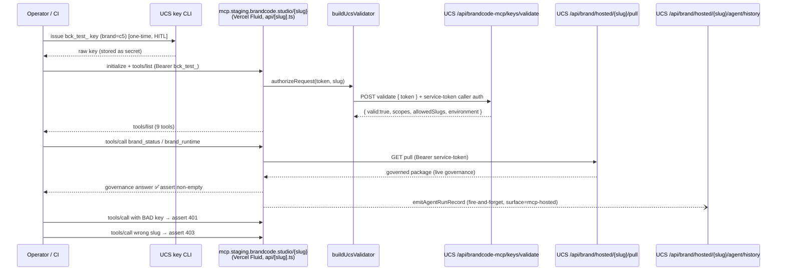

# feat: Hosted Brandcode MCP — staging vertical slice + end-to-end smoke

> **Spans two repos.** Plan home + most units: `brandsystem-mcp` (this repo). UCS-side units are tagged **Target repo: UCS** (`~/Desktop/UCS`) and use UCS-relative paths.

## Summary

The hosted "Use" MCP is fully wired but has never run over HTTP in any deployed environment. This plan ships the smallest cut that proves the whole path — issue a real key → deployed `mcp.staging.brandcode.studio/{slug}` → authed tool call → live governance answer — and adds the two things that make a staging surface *trustworthy*: live AgentRun telemetry (currently a no-op) and a documented key-hash parity decision before any production key is minted. Production promotion, a Console key UI, durable rate-limiting, and a standalone health probe are explicitly deferred.

The deploy itself (Vercel project, DNS, env/secrets) is human-in-the-loop; this plan delivers the code, the automated smoke, the CI gate, and the runbook so the human steps are mechanical and verifiable.

---

## Problem Frame

Auth is wired end-to-end and green in unit tests on both sides (`buildUcsValidator` ↔ UCS `/api/brandcode-mcp/keys/validate`), all hosted tools read live governance from the UCS pull package, and rate limiting is wired in `src/hosted/router.ts`. But **nothing has crossed the deployed transport**: no Vercel deploy, no real `bck_test_` key ever issued or exercised, `emitAgentRunRecord` is a no-op, and there's no automated proof that `initialize → tools/list → authed call → 401/403` actually works over HTTP against live UCS. Every integration seam between the MCP transport, the UCS validator, and the governance pull is currently unproven in aggregate. Until one real authed call traverses a deployed instance, "it works" is an inference, not a fact — and telemetry being a no-op means even after deploy we'd be blind to whether real calls succeed.

---

## Scope Boundaries

### In scope
- Replace the `emitAgentRunRecord` no-op with a real, fail-open POST to the existing UCS agent/history sink (telemetry).
- An automated end-to-end smoke that runs against a configurable **deployed** URL + key, asserting the full MCP handshake, an authed governance read, and the 401/403 auth boundaries.
- A GitHub Action that runs the smoke against staging on demand / on a schedule, turning it into a permanent regression gate.
- A staging deploy runbook + env-var contract + a preflight the smoke can call, so the HITL deploy steps are mechanical.
- A key-hash parity **decision record** (argon2id vs SHA-256) and a rate-limit launch-posture note, before any `bck_live_` key exists.

### Deferred to Follow-Up Work
- **Production promotion** (ideation idea #6): same artifact + `BRANDCODE_MCP_ENV=production` + `bck_live_` keys + `mcp.brandcode.studio` DNS, gated on staging smoke green. This is the next milestone, not this cut.
- **Standalone health/readiness probe** (ideation idea #5): folded minimally into the smoke's first assertion here; a dedicated probe is later.
- **Key lifecycle runbook — rotate/revoke/audit** (ideation idea #4): issuance is exercised here; full rotation UX + audit log is follow-on.
- **Durable (Upstash) rate-limit store**: in-process is the launch posture (see KTD5).
- **Brand Console key-management UI**: out of scope for v1 (operator/CLI issuance only).

### Non-goals
- No new hosted tools; no change to the 9-tool surface.
- No change to the `provider` enum or the auth contract (both already shipped).
- No build/extract/compile tools in the hosted surface (delegated to local `@brandsystem/mcp` by design).

---

## Key Technical Decisions

**KTD1 — Keep SHA-256 for key hashing; document the charter's argon2id line as superseded.** `(needs confirmation — security decision)`
The charter (§456) specifies argon2id, but UCS shipped `createHash("sha256")` over a **32-byte base62 random secret** (~190 bits entropy). argon2id's memory-hard KDF exists to slow brute-force against *low-entropy, human-chosen* secrets; for high-entropy random API tokens it adds latency and operational complexity with no meaningful security gain. This matches how high-entropy API keys are hashed in practice (e.g. GitHub/Stripe-style token stores use fast hashes over random secrets). **Decision: keep SHA-256, record the rationale in a decision doc, and amend the charter line.** If the reviewer prefers argon2id anyway, that's a UCS-side swap in `brandcode-mcp-key-registry.ts` + re-issue — cheap now, expensive after `bck_live_` keys exist, which is exactly why it's settled before production.

**KTD2 — Prove the UCS validator path, not the local shim.** Staging must run with `BRANDCODE_MCP_TEST_KEYS` **unset** so `authorizeRequest` falls through to `buildUcsValidator` → UCS `/api/brandcode-mcp/keys/validate`. If the env table is set, the smoke would prove the local path and leave the real integration unproven. The smoke asserts the validator actually round-tripped to UCS (a known-revoked or wrong-env key must 401).

**KTD3 — Telemetry is fire-and-forget and fail-open.** `emitAgentRunRecord` must never block, delay, or change a tool response. Reuse the proven pattern in `src/hosted/feedback-fetcher.ts` (same `POST /api/brand/hosted/{slug}/agent/history`, same `{ entry: AgentRunHistoryEntry }` contract, `surface: "mcp-hosted"`). On any upstream failure, swallow + best-effort log; the tool result is already sent.

**KTD4 — Smoke targets an existing compiled brand; default `c5`.** Either `c5` or `brandcode` works (both compiled, both governance-rich). Default `c5`; the brand slug is a smoke env var so it's swappable without code change.

**KTD5 — In-process rate limiting is the staging launch posture.** `router.ts` already enforces a per-key-per-brand in-process fixed window. Durable (Upstash) shared store is deferred; the explicit upgrade trigger is **multi-instance or multi-region production traffic** (in-process windows don't coordinate across Fluid instances). Documented, not built.

**KTD6 — The smoke key and service token are secrets, never committed.** Local run reads them from env; CI reads them from repository secrets. The smoke refuses to run (clear error) if its required env vars are absent.

---

## High-Level Technical Design

The smoke exercises this full path against the deployed instance:

Telemetry write (U1) is the dashed async arrow — it never sits on the response path.

---

## Requirements Traceability

| Req | Source (origin ideation) | Advanced by |
|-----|--------------------------|-------------|
| R1 — Deployed instance serves an authed tool call end-to-end | Idea #1 | U2, U4 |
| R2 — The UCS validator path (not the local shim) is what's proven | Idea #1 / KTD2 | U2 |
| R3 — Auth boundaries (401 bad key, 403 wrong slug) hold over HTTP | Idea #1 | U2 |
| R4 — Hosted tool calls are observable | Idea #2 | U1 |
| R5 — Smoke is a repeatable regression gate | Idea #1 | U2, U3 |
| R6 — Key-hash algorithm settled before production keys | Idea #3 | U5 |
| R7 — Rate-limit launch posture explicit | Idea #3 | U5 |

---

## Implementation Units

### U1. Wire `emitAgentRunRecord` to the UCS agent/history sink
**Target repo:** brandsystem-mcp
**Goal:** Replace the telemetry no-op with a real fire-and-forget POST so every hosted tool dispatch emits an AgentRun receipt.
**Requirements:** R4
**Dependencies:** none (the UCS sink + contract already exist and are exercised by `brand_feedback`).
**Files:**
- `src/hosted/telemetry.ts` (implement `emitAgentRunRecord`)
- `src/hosted/feedback-fetcher.ts` (reference the proven POST shape; extract a shared helper only if it falls out naturally — do not over-refactor)
- `src/hosted/router.ts` (confirm the call site passes tool, outcome, latencyMs, requestId, auth)
- `test/hosted/telemetry.test.ts` (new)
**Approach:** Build an `AgentRunHistoryEntry` mirroring `feedback-fetcher.ts` (run id `mcp-run-<tool>-<uuid>`, `surface: "mcp-hosted"`, outcome, latency, tool, requestId, a `receipt` of kind `tool_invocation`). POST to `/api/brand/hosted/{slug}/agent/history` with the service-token. Wrap in fire-and-forget: never await on the response path in a way that delays the tool result; swallow all errors after a best-effort `console.error`. Keep `HOSTED_AGENT_RUN_TELEMETRY_STATUS` but flip its value (e.g. `active`) or remove its "deferred" semantics.
**Patterns to follow:** `src/hosted/feedback-fetcher.ts` (endpoint, headers, `{ entry }` body, error mapping); `AbortSignal.timeout` usage in `src/hosted/brand-fetcher.ts`.
**Test scenarios:**
- Happy path: a successful dispatch emits one POST with `surface: "mcp-hosted"`, correct tool, outcome `ok`, and a numeric latency (mock `fetch`, assert body shape).
- Outcome mapping: auth_error / upstream_error / tool_error each serialize to the right `outcome` value.
- Fail-open: when the history POST rejects (network) or returns 500, `emitAgentRunRecord` resolves without throwing and the caller's tool result is unaffected.
- Non-blocking: the tool response is produced even if the telemetry POST is still pending / never resolves (assert the dispatch path doesn't await it on the critical path).
- Never logs the bearer token or service token.
**Verification:** `npm run build`, `npm run lint`, `npm test` green; new tests assert the POST shape + fail-open; no telemetry latency on the tool response path.

### U2. End-to-end smoke harness against a deployed URL
**Target repo:** brandsystem-mcp
**Goal:** One runnable script that proves the full path against any deployed `{baseUrl}/{slug}` using a real key from env.
**Requirements:** R1, R2, R3, R5
**Dependencies:** U1 (so the happy-path call also exercises telemetry, though the smoke asserts the tool result, not the async receipt).
**Files:**
- `scripts/hosted-smoke.mjs` (new — the harness)
- `test/hosted/smoke.contract.test.ts` (new — unit-level guard on the harness's request builders / assertion helpers, runnable offline)
- `package.json` (add `"smoke:hosted"` script)
- `docs/hosted-smoke.md` (new — how to run it, required env)
**Approach:** A standalone Node script (MCP Streamable HTTP client against the deployed URL). Reads env: `SMOKE_BASE_URL` (e.g. `https://mcp.staging.brandcode.studio`), `SMOKE_SLUG` (default `c5`), `SMOKE_KEY` (a `bck_test_` key), `SMOKE_BAD_KEY` (optional; default a malformed token), `SMOKE_WRONG_SLUG` (a slug the key is not authorized for). Refuse to run with a clear error if `SMOKE_BASE_URL` or `SMOKE_KEY` is missing (KTD6). Steps + assertions:
1. `initialize` + `tools/list` with the valid key → assert the 9 locked tools are present.
2. `brand_status` (and `brand_runtime` minimal slice) → assert a non-empty governed response (live governance crossed the wire — R1).
3. Bad/missing key → assert HTTP/JSON-RPC 401 path (R3).
4. Wrong slug with the valid key → assert 403 `slug_forbidden` (R3) — this also proves the UCS validator round-trip (R2), since allowedSlugs came from UCS.
5. Print a compact pass/fail report; non-zero exit on any failure (CI-friendly).
**Patterns to follow:** the MCP SDK client usage in `test/hosted/*` and `bin/brandcode-mcp.mjs`; reuse `HOSTED_TOOL_ORDER` from `src/hosted/registrations.ts` for the tools/list assertion.
**Test scenarios (for the offline contract test, not the live smoke):**
- Request builders produce well-formed JSON-RPC `initialize` / `tools/call` payloads.
- The tools/list assertion fails when a tool is missing and passes on the full `HOSTED_TOOL_ORDER`.
- Missing `SMOKE_BASE_URL`/`SMOKE_KEY` → the harness exits non-zero with a clear message (no network attempted).
- The "expect 401" and "expect 403" assertion helpers correctly classify sample responses.
**Verification:** offline contract test green in `npm test`; a manual run against a deployed staging URL passes all 4 live assertions (recorded in `docs/hosted-smoke.md`).

### U3. GitHub Action: run the smoke against staging
**Target repo:** brandsystem-mcp
**Goal:** Turn U2 into a permanent regression gate that runs on demand and on a schedule.
**Requirements:** R5
**Dependencies:** U2; **HITL:** repo secrets must be set (`SMOKE_BASE_URL`, `SMOKE_SLUG`, `SMOKE_KEY`, `SMOKE_WRONG_SLUG`).
**Files:**
- `.github/workflows/hosted-smoke.yml` (new)
**Approach:** `workflow_dispatch` + `schedule` (e.g. daily) triggers; Node 24; `npm ci && npm run build && npm run smoke:hosted`; reads the smoke env from `secrets`. Not a PR-blocking gate initially (staging may be down for reasons unrelated to a PR) — runs post-deploy and on schedule; promote to a required check after staging stabilizes. Job summary surfaces the smoke's pass/fail report.
**Patterns to follow:** existing `.github/workflows/ci.yml` (Node setup, npm ci/build) and `publish.yml`.
**Test scenarios:** `Test expectation: none -- CI workflow YAML; behavior is validated by U2's smoke and a manual workflow_dispatch run.`
**Verification:** a manual `workflow_dispatch` run against staging goes green; secrets are referenced, never inlined.

### U4. Staging deploy config + preflight + runbook
**Target repo:** brandsystem-mcp
**Goal:** Make the HITL deploy mechanical and verifiable — the env-var contract, a config sanity check, and a step-by-step runbook.
**Requirements:** R1
**Dependencies:** none for the docs/preflight; **HITL:** Vercel project, `mcp.staging.brandcode.studio` DNS, and env vars require account access.
**Files:**
- `docs/hosted-deploy-staging.md` (new — runbook)
- `api/[slug].ts` (confirm the misconfig 500 covers the cases below; extend the error body only if a gap is found)
- optionally `scripts/hosted-preflight.mjs` (new — asserts required env present + UCS reachability) OR fold preflight into U2's first assertion
**Approach:** Document the exact env contract: `BRANDCODE_MCP_SERVICE_TOKEN` (must match the UCS env of the target `UCS_API_BASE_URL`), `UCS_API_BASE_URL`, `BRANDCODE_MCP_ENV=staging`, and **`BRANDCODE_MCP_TEST_KEYS` unset** (KTD2). Runbook steps: create/confirm Vercel project → set env vars → map DNS `mcp.staging.brandcode.studio` → deploy → run preflight → run U2 smoke → record the result. Call out the **hard dependency**: UCS's `/api/brandcode-mcp/keys/validate` and `/api/brand/hosted/{slug}/pull` must be deployed and reachable at `UCS_API_BASE_URL` (the routes are on UCS `main`; confirm they're live in the targeted UCS environment).
**Patterns to follow:** `api/[slug].ts` existing misconfig guard; `vercel.json` rewrite; `bin/brandcode-mcp.mjs` env documentation.
**Test scenarios:** `Test expectation: none -- runbook + config; the preflight (if built) gets its assertion coverage folded into U2's contract test.`
**Verification:** a human follows the runbook and the U2 smoke passes against the resulting staging URL.

### U5. Key-hash parity decision record + rate-limit posture note
**Target repo:** UCS (`~/Desktop/UCS`)
**Goal:** Settle the argon2id-vs-SHA-256 question and the rate-limit launch posture in writing before any production key exists.
**Requirements:** R6, R7
**Dependencies:** none.
**Files (UCS-relative):**
- `brand-os/s009-brandcode-mcp-key-hashing-decision-v0.1.md` (new — the decision record; or append to the existing key-registry spec)
- `app/tools/lib/brandcode-mcp-key-registry.ts` (only if the decision is to switch to argon2id; otherwise no code change)
**Approach:** Record the decision per KTD1 (recommend keep SHA-256 + rationale + amend the charter §456 line). Add a short "rate-limit launch posture" section per KTD5 (in-process now; upgrade trigger = multi-instance/region traffic; where Upstash would plug in). If the reviewer chooses argon2id, this unit also covers the registry swap + re-hash/re-issue note and its `npm run test:studio` update.
**Patterns to follow:** existing `brand-os/s009-*` decision/spec docs.
**Test scenarios:** decision-only by default → `Test expectation: none -- decision record`. If argon2id is chosen: hashing round-trip test in `tests/studio/brandcode-mcp-key-registry.test.mjs` (issue → validate still passes; stored value is argon2id-formatted, not raw).
**Verification:** decision doc committed; if code changed, `npx tsc --noEmit` + `npm run test:studio` green on the UCS side.

---

## System-Wide Impact

- **Two repos, one outcome.** U1–U4 in brandsystem-mcp; U5 in UCS. No shared build; the integration contract (validate + pull + history endpoints) is already shipped on both sides.
- **Telemetry feeds existing UCS surfaces.** U1's receipts land in the same AgentRun history that UCS brand-health and the Brand Console already read — so observability compounds without new UCS UI.
- **No production traffic yet.** Everything here targets staging; the fail-open telemetry + unset test-keys posture means a misconfigured staging deploy degrades to clear errors, never to silently-wrong auth.

---

## Risks & Dependencies

| Risk / Dependency | Impact | Mitigation |
|---|---|---|
| **HITL: Vercel project + DNS + env/secrets** (no account access in-session) | U4/U3 can't be completed by the agent alone | Plan delivers code + runbook + preflight so human steps are mechanical and verifiable; flagged explicitly |
| **UCS validate/pull routes not deployed at `UCS_API_BASE_URL`** | Smoke 401s / empty governance despite correct MCP | U4 runbook makes "confirm UCS routes live in target env" a gating preflight step before the smoke |
| Telemetry POST adds latency or fails | Slows or breaks tool responses | KTD3 fire-and-forget + fail-open; U1 tests assert non-blocking + no-throw |
| Smoke key leakage | Cross-brand read in staging | KTD6 secrets-only; staging keys are `bck_test_`, scoped to one brand; rotate if exposed |
| In-process rate limit doesn't coordinate across Fluid instances | Over-permissive limits under multi-instance staging | KTD5 documents the posture + the upgrade trigger; acceptable at staging volume |
| Hashing decision reversed after keys issued | Re-hash/re-issue churn | U5 settles it before any `bck_live_` key exists |

---

## Sources & Research

- Origin ideation: `docs/ideation/2026-06-27-hosted-mcp-production-cutover-ideation.md`
- Charter: `s009-brandcode-mcp-discovery-charter-v0.1.md` (UCS `brand-os/`) — Milestone B (staging→prod), §203 rate limits, §456 argon2id (superseded by KTD1)
- Prior art in-repo: `src/hosted/feedback-fetcher.ts` (proven agent/history POST), `src/hosted/router.ts` (rate-limit wiring), `src/hosted/auth.ts` (`buildUcsValidator`, committed `68fb4c1`), `api/[slug].ts` + `vercel.json` (deploy scaffold)
- UCS side: `app/api/brandcode-mcp/keys/validate`, `app/api/brand/hosted/[slug]/agent/history`, `app/tools/lib/brandcode-mcp-key-registry.ts`, `npm run brandcode-mcp:key`

---

## Sequencing

1. **U5** (decision; unblocks any future production key; no code dependency) — can run in parallel with everything.
2. **U1** (telemetry) — independent, lands in the MCP repo.
3. **U2** (smoke) — depends on U1 for the telemetry-inclusive happy path.
4. **U4** (deploy runbook + preflight) — needed before a live smoke run; HITL.
5. **U3** (CI gate) — wraps U2 once staging exists and secrets are set.

U1, U2, U5 are agent-completable now. U3/U4 reach a HITL boundary (Vercel/DNS/secrets) — the agent produces everything up to the deploy action.
