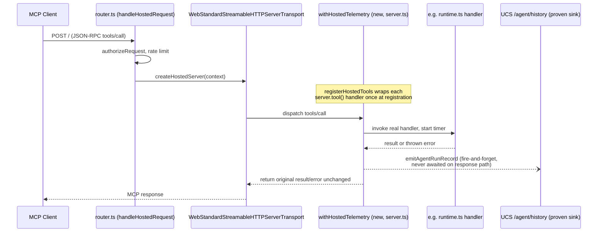

# feat: Hosted MCP observability/governance hardening + Build MCP coherence pass

## Summary

Bundles survivors #1–#5 from the 2026-07-01 ideation into one hardening pass across both `@brandsystem/mcp` (local Build MCP) and the hosted Brandcode MCP (`src/hosted/`). All five units are fully agent-completable today — none touch DNS, Vercel production env, or the locked 9-tool surface's membership. They close: (1) the hosted telemetry no-op, (2) a real integrity gap in how the "tool count lock" is enforced, (3) the missing CI regression gate for the existing hosted smoke script, (4) two forms of hardcoded-array duplication plus an unenforced contract-version pin, and (5) three small coherence/doc-drift issues on the local MCP's tool surface.

## Problem Frame

An extensive parallel operational workstream (recorded in `HANDOFF.md` and `specs/brandcode-mcp-operational-roadmap-m001-m003.md`) has already taken the hosted MCP through staging deploy, durable rate-limiting, and a real limited-client pilot. Production is correctly blocked on infrastructure access only the human operator has, and that path is out of scope here. But several genuinely open engineering gaps survived that entire effort because they don't block staging or the pilot — they're latent risks that will matter as soon as a second client, a second hosted tool change, or a production incident happens. Left alone: hosted tool calls stay operationally invisible (no telemetry), the "eight/nine-tool lock" that the whole limited-client trust story rests on is enforced only by a count that a future PR could route around without detection (a pattern already present locally), a well-built smoke harness never runs unless a human remembers to type the command, a contract-version pin has never actually caught the exact class of bug it names, and the local Build MCP's own documentation has quietly drifted from its code.

## Scope Boundaries

### In scope
- Wire real hosted AgentRun telemetry via a single instrumentation point, using the already-proven UCS feedback contract as the pattern.
- Define and enforce the hosted tool-count lock as a capability-surface invariant, not a name-count.
- Add a scheduled, non-blocking GitHub Actions workflow running the existing `scripts/hosted-mcp-smoke.mjs` against staging.
- Deduplicate the two hardcoded locked-tool-order arrays; add a golden-fixture test that actually checks the pinned connector contract version against a recorded real UCS response shape.
- Fix a confirmed doc-drift in CLAUDE.md's tool count; add a standing description-quality check; surface the existing 9-group tool taxonomy to connecting agents.

### Deferred to Follow-Up Work
- **Backup operator/escalation runbook** (ideation #6) — pure documentation, but the actual content (who is the backup, what authority they hold) is Jason's decision to make, not an agent's. An agent can draft the decision-tree *structure* on request; not bundled into this code-focused plan.
- **Local Build MCP search primitive over `.brand/` data** (ideation #7) — legitimate new capability, but larger in scope and lower urgency than the five hardening items here; deserves its own ideation-to-plan cycle.
- **HANDOFF.md / `.claudex/packets`-`.claudex/prompts` restructuring** — real friction, but changes the human operator's own daily process; needs explicit buy-in before any agent touches it.
- Everything on the hosted-MCP production path (DNS, Vercel production env, `bck_live_` key issuance) — already fully specified in `specs/brandcode-mcp-operational-roadmap-m001-m003.md` and explicitly blocked on infra access this plan does not have.

### Non-goals
- No change to which 9 tools are registered, or their scopes.
- No change to the UCS repo (all five units are single-repo, `brandsystem-mcp` only).
- No new hosted or local tools.

---

## Key Technical Decisions

**KTD1 — Instrument telemetry at the single registration choke point, not inside all 9 tool handlers.** `router.ts` hands the whole `Request` to `WebStandardStreamableHTTPServerTransport`, which dispatches internally to whichever tool the MCP protocol message names — there is no per-tool-call hook in the router. But `src/hosted/server.ts`'s `createHostedServer()` is the single place all 9 tools get registered, via `registerHostedTools(server, context)` in `src/hosted/registrations.ts`. Wrap `server.tool` once, at that boundary, so every current and future tool gets instrumented automatically — instead of editing 9 separate tool files (`runtime.ts`, `search.ts`, `check.ts`, `status.ts`, `assets.ts` ×2, `feedback.ts`, `capture-taste.ts`, `history.ts`) by hand, which is both more work and a second place to remember when tool #10 is ever added.

**KTD2 — Telemetry body mirrors `feedback-fetcher.ts` exactly; POST is fire-and-forget and fail-open.** `emitAgentRunRecord()`'s consumer must never see added latency or a broken tool response because of a telemetry failure. `AppendHostedFeedbackOptions`/`appendHostedFeedback()` in `src/hosted/feedback-fetcher.ts` is the proven, working reference for constructing an `AgentRunHistoryEntry` and POSTing to `/api/brand/hosted/{slug}/agent/history` with `{ entry }`. Reuse its shape; do not re-derive.

**KTD3 — "Capability surface," for the tool-lock test, means: distinct registered tool names AND distinct top-level write/side-effect actions within a single registration.** The concrete failure mode this guards against (proven to already exist locally: `brand_feedback` registers 3 tool names from one file) is a future hosted change that adds a `mode` parameter or sibling `server.tool()` call inside an *existing* hosted tool file, growing capability while `HOSTED_TOOL_ORDER`'s length stays 9. The test asserts both: (a) `HOSTED_TOOL_ORDER.length` matches an exact expected count (currently 9, not `>=`), and (b) each of the 9 files under `src/hosted/tools/` calls `server.tool(...)` exactly once (i.e., registers exactly one tool name), by statically counting `server.tool(` call sites per file. A future PR that adds a second `server.tool()` call to any hosted tool file fails this test even if it reuses an existing name in `HOSTED_TOOL_ORDER`.

**KTD4 — Golden-fixture contract test uses a recorded, real UCS response shape, not a hand-typed mock.** The current test-mock literals in `test/connectors/brandcode-client.test.ts` prove the mock matches the mock — they were written by the same person who wrote the connector code, so they can't catch drift. Capture one real `GET /api/brand/hosted/{slug}/pull` response body (redacting any secrets) from a working staging call as a checked-in JSON fixture, and assert the connector's Zod/TS parsing succeeds against it byte-for-byte, separately from the existing hand-written unit-test mocks (which stay, for handler-logic coverage).

**KTD5 — Tool-description-quality check covers only the mechanically-verifiable subset of CLAUDE.md's guidelines.** "Verb-first," "under 300 chars for the first sentence," and "mentions NOT-for when overlapping tools exist" are regex/string checks. "Crisp and mutually exclusive" is a judgment call the test does not attempt — this is Phase 3.7 anti-scope-creep discipline: automate what's checkable, leave the rest to human review as before.

---

## High-Level Technical Design

U1's wrapper sits between tool registration and tool execution — every tool gets instrumented without any tool file being edited.

---

## Requirements Traceability

| Req | Source (ideation) | Advanced by |
|-----|---|---|
| R1 — Hosted tool calls emit a real AgentRun record via the proven UCS sink | Idea #1 | U1 |
| R2 — Telemetry never blocks or breaks a tool response | Idea #1 / KTD2 | U1 |
| R3 — Tool-count lock catches capability growth, not just name-count growth | Idea #2 | U2 |
| R4 — Hosted smoke script runs automatically, not only by hand | Idea #3 | U3 |
| R5 — The two hardcoded tool-order arrays cannot silently diverge | Idea #4 | U4 |
| R6 — The pinned connector contract version is checked against a real UCS shape | Idea #4 | U4 |
| R7 — CLAUDE.md's tool-count claim matches reality | Idea #5 | U5 |
| R8 — Tool description quality doesn't silently regress | Idea #5 | U5 |
| R9 — Agents get the existing 9-group taxonomy without a 41-tool consolidation | Idea #5 | U5 |

---

## Implementation Units

### U1. Wire real hosted AgentRun telemetry at the registration boundary
**Goal:** Replace the `emitAgentRunRecord()` no-op with a working implementation, instrumented once at tool registration so all 9 current (and any future) hosted tools are covered automatically.
**Requirements:** R1, R2
**Dependencies:** none.
**Files:**
- `src/hosted/telemetry.ts` (implement `emitAgentRunRecord`, reusing `feedback-fetcher.ts`'s POST shape)
- `src/hosted/server.ts` (add the instrumentation wrapper around `registerHostedTools(server, context)`)
- `src/hosted/registrations.ts` (only if the wrapper needs to intercept at this layer instead of `server.ts` — implementer's call per KTD1's spirit; either file is an acceptable choke point, `server.ts` is preferred since it's the outermost)
- `test/hosted/telemetry.test.ts` (new)
- `test/hosted/server.test.ts` (new, or extend if one exists — verify at plan-execution time)
**Approach:** Per KTD1, wrap `McpServer.tool` (or wrap the `context` passed into each `registerXxx` call — whichever the MCP SDK's `server.tool()` signature makes cleanest to intercept without fighting its types) so that every tool handler's invocation is timed and its outcome classified into the existing `AgentRunRecordInput.outcome` enum (`ok | auth_error | upstream_error | tool_error | stub`) before calling `emitAgentRunRecord()`. Build the `AgentRunHistoryEntry` per KTD2, POST via a helper mirroring `appendHostedFeedback()`. Fire-and-forget: do not `await` the POST on the path that returns the tool's actual result to the client; swallow all telemetry-POST errors after a best-effort `console.error` (never surface a telemetry failure to the MCP client). Never log the bearer token or service token.
**Execution note:** Write the failing "telemetry never blocks the response" test first — it's the one invariant most likely to be silently violated by an implementation that reaches for `await` out of habit.
**Patterns to follow:** `src/hosted/feedback-fetcher.ts` (POST shape, error-code mapping, `AbortSignal.timeout`); the existing `AgentRunRecordInput` interface in `telemetry.ts` (do not change its shape, implement against it).
**Test scenarios:**
- Happy path: a successful tool call results in exactly one telemetry POST with `outcome: "ok"`, correct `tool` name, a numeric `latencyMs`, and `surface: "mcp-hosted"`.
- Outcome mapping: simulate each of `auth_error` / `upstream_error` / `tool_error` and assert the corresponding `outcome` value is sent.
- Fail-open: telemetry POST rejects (network error) or returns non-2xx — `emitAgentRunRecord` resolves without throwing, and does not alter the tool's own response.
- Non-blocking: assert the tool's response is produced without waiting on the telemetry POST settling (e.g., a POST that never resolves does not hang the tool response).
- Coverage: calling any one of the 9 registered tools results in a telemetry record being attempted — prove the wrapper covers the whole registration, not one hand-picked tool.
- Never logs the raw bearer token or `ucsServiceToken` in any error path.
**Verification:** `npm run build`, `npm run lint`, `npm test` green; new tests assert POST shape, outcome mapping, fail-open behavior, and non-blocking timing; manual smoke (`npm run smoke:hosted-mcp` against staging, if credentials are available in the session) shows a corresponding history entry appear via `brand_history`.

### U2. Govern the hosted tool lock by capability surface, not registration-name count
**Goal:** Add a test that fails if a future change grows hosted capability while keeping the same 9 registered tool names.
**Requirements:** R3
**Dependencies:** none.
**Files:**
- `test/hosted/registrations.test.ts` (new, or extend `test/hosted/tools.test.ts` if that's the more natural home — check both before creating a new file)
**Approach:** Per KTD3, assert two things: (a) `HOSTED_TOOL_ORDER.length` equals an exact expected constant (9 today), not a `>=` floor; (b) statically read each file under `src/hosted/tools/` and count `server.tool(` (or the SDK's registration call) occurrences per file, asserting each file registers exactly one tool. Also assert `TOOL_SCOPE_REQUIREMENTS` (in `src/hosted/auth.ts`) has exactly one entry per name in `HOSTED_TOOL_ORDER` — closing the gap where a name could exist in one list but not the other.
**Patterns to follow:** `test/hosted/auth.test.ts`'s existing `"covers every locked hosted tool for each key posture"` test, which already cross-checks `TOOL_SCOPE_REQUIREMENTS` against `HOSTED_TOOL_ORDER` — extend that pattern rather than inventing a new one.
**Test scenarios:**
- `HOSTED_TOOL_ORDER.length` is exactly 9 (fails if it becomes 8 or 10 without an explicit, reviewed test update).
- Each file in `src/hosted/tools/` registers exactly one tool name (fails if a future edit adds a second `server.tool()` call to an existing file — the exact `brand_feedback`-shaped pattern found locally).
- `TOOL_SCOPE_REQUIREMENTS` and `HOSTED_TOOL_ORDER` have identical membership (already partially covered by an existing test — confirm and extend, don't duplicate).
**Verification:** the new/extended test fails when manually and temporarily adding a second `server.tool()` call to any one hosted tool file (a quick local sanity check before considering the unit done, then revert the temporary change) — proves the test actually catches the failure mode it's named for, not just a tautology.

### U3. Wire the existing hosted smoke script into a scheduled CI workflow
**Goal:** Turn `scripts/hosted-mcp-smoke.mjs` from a manual-only proof into an automatic, non-blocking regression signal against staging.
**Requirements:** R4
**Dependencies:** none for the workflow file; **HITL:** GitHub repo secrets (`BRANDCODE_MCP_SMOKE_URL`, `BRANDCODE_MCP_SMOKE_FULL_KEY`, optionally `BRANDCODE_MCP_SMOKE_READ_KEY`) must exist for the workflow to actually run — these already exist somewhere given the script has been run manually per HANDOFF.md; this unit is about making them reachable to GitHub Actions, not generating new ones.
**Files:**
- `.github/workflows/hosted-smoke.yml` (new)
**Approach:** `workflow_dispatch` (manual trigger) + `schedule` (daily cron). Node 24 (matching the rest of CI's Node-24 compatibility work). Steps: `npm ci && npm run build`, then `npm run smoke:hosted-mcp -- --strict --json`, reading `BRANDCODE_MCP_SMOKE_URL`/`_FULL_KEY`/etc. from `secrets`. Per the script's own documented exit codes (pass→0, blocked/skipped→0 or 2 with `--strict`, failed→1), a failing run fails the workflow. Do **not** add this workflow as a required check on `ci.yml`'s `pull_request` trigger — it hits a live external endpoint and real keys, and staging downtime unrelated to any code change would otherwise block unrelated PRs. Job summary should surface the script's own JSON report for quick triage.
**Patterns to follow:** `.github/workflows/benchmark.yml` (scheduled/dispatch trigger shape, Node setup); `.github/workflows/ci.yml` (npm ci/build pattern, Node 24 usage).
**Test scenarios:** `Test expectation: none -- CI workflow YAML; behavior is validated by U1/U2's tests plus a manual workflow_dispatch run.`
**Verification:** a manual `workflow_dispatch` run (triggered after this unit lands) goes green against the currently-working staging deployment; secrets are referenced by name only, never inlined in the YAML.

### U4. Deduplicate tool-order arrays; add a real contract-version conformance test
**Goal:** Close two related but distinct drift vectors: an in-repo duplicated array, and a cross-repo contract pin that's never actually checked against reality.
**Requirements:** R5, R6
**Dependencies:** none.
**Files:**
- `src/hosted/registrations.ts` (export `HOSTED_TOOL_ORDER` — already exported; no change needed here beyond confirming it's the canonical source)
- `scripts/hosted-mcp-smoke.mjs` (remove its own hardcoded `LOCKED_TOOL_ORDER`; import `HOSTED_TOOL_ORDER` from the built `dist/hosted/registrations.js`, or from a shared constants module if the script can't import compiled `src/` output directly — check how the script currently resolves its other imports of `@modelcontextprotocol/sdk` to determine the right import path)
- `test/connectors/fixtures/hosted-pull-response.json` (new — a redacted, real recorded UCS `pull` response body)
- `test/connectors/brandcode-contract-fixture.test.ts` (new)
**Approach:** For the array dedup: `scripts/hosted-mcp-smoke.mjs` already imports from `@modelcontextprotocol/sdk`, confirming it can resolve dependencies at runtime as an ES module — import `HOSTED_TOOL_ORDER` the same way rather than redeclaring it; if a direct import from compiled `dist/` output is awkward for a standalone script, extracting `HOSTED_TOOL_ORDER` into a tiny shared module with no other dependencies (so it's trivially importable from both a compiled tool file and a standalone script) is an acceptable alternative — implementer's call, but a single source of truth is the non-negotiable outcome. For the contract fixture: capture one real, redacted `GET /api/brand/hosted/{slug}/pull` response (via the existing smoke script's own `--json` mode against staging, or a value already visible in HANDOFF.md/prior proof artifacts) as a checked-in JSON fixture; write a test that runs the connector's actual parsing/type-narrowing logic against that fixture and asserts it succeeds — this is in addition to, not a replacement for, the existing hand-written mock-based tests in `test/connectors/brandcode-client.test.ts`.
**Patterns to follow:** `test/connectors/brandcode-client.test.ts` for the connector's existing test conventions; the smoke script's existing `--json` output mode as the easiest path to capturing a real fixture.
**Test scenarios:**
- The smoke script's tool-order assertion still passes after switching to the shared import (regression check on the refactor itself).
- The connector's parser successfully processes the checked-in real-response fixture without throwing or dropping fields the connector's types declare as present.
- A deliberately mutated copy of the fixture (e.g., a renamed field simulating a UCS shape change) causes the conformance test to fail — proves the test can actually catch drift, not just pass tautologically.
**Verification:** `npm run build`, `npm test` green; manually confirm (once, during implementation) that mutating the fixture produces a test failure, then revert.

### U5. Local Build MCP tool-surface coherence pass
**Goal:** Close a confirmed doc-drift, add a standing description-quality check, and surface the existing session taxonomy to agents.
**Requirements:** R7, R8, R9
**Dependencies:** none.
**Files:**
- `CLAUDE.md` (fix the "34 files, 36 tools" line to match the actual current count)
- `test/tools/description-quality.test.ts` (new)
- `src/tools/brand-status.ts` (extend the response to include the session/phase grouping — confirm this is the right home vs. a new resource; `brand_status` is already documented as the "what can I do?" resume point, making it the natural place)
- `test/tools/smoke.test.ts` (update the tool-count assertion per the note below)
**Approach:** (a) Read the actual current tool-file and registration counts at implementation time (they will have moved again since this plan was written) and either hand-fix the CLAUDE.md line or replace it with a short note pointing to `ls src/tools/ | wc -l` as the source of truth, whichever the implementer judges less likely to re-drift. (b) Write a test that iterates every registered tool's description string (via the same `client.listTools()` call pattern `test/tools/smoke.test.ts` already uses) and asserts the mechanically-checkable subset of CLAUDE.md's "Tool Description Guidelines" per KTD5: starts with a capitalized verb, first sentence under 300 characters, and — for any tool file that itself contains "NOT for" as a Session-1/2/3 disambiguation convention already used elsewhere — that the convention is present when the tool's name is a known ambiguous pair (a small, explicit allowlist of pairs like `brand_extract_web`/`brand_extract_site`, `brand_check`/`brand_check_compliance`, seeded from this ideation's own findings; do not attempt to auto-detect ambiguity generally). (c) Add the 9-group session/phase name (matching `src/server.ts`'s existing comment structure) as a field agents can read from `brand_status`'s response, sourced from a small manifest the implementer adds (do not hand-guess; derive it from the actual `src/server.ts` structure, e.g., a comment-adjacent array literal or a lightweight per-tool metadata table) rather than re-deriving the grouping from tool-name heuristics.
**Execution note:** For (c), read `src/server.ts`'s current registration order and comments fresh at implementation time — they may have shifted since this plan was written.
**Patterns to follow:** `test/tools/smoke.test.ts`'s existing `client.listTools()` usage for (b); CLAUDE.md's own "Tool Description Guidelines" section for the exact criteria to encode.
**Test scenarios:**
- (b) Every registered tool's description starts with a capitalized verb.
- (b) Every registered tool's first sentence (up to the first period) is under 300 characters.
- (b) The seeded ambiguous-pair allowlist (`brand_extract_web`/`brand_extract_site`, `brand_check`/`brand_check_compliance`, others found during implementation) each contain a "NOT for" cross-reference to their pair.
- (c) `brand_status`'s response includes a session/phase field whose value set matches the 9 groups named in `src/server.ts`'s comments.
- (a) `Test expectation: none -- doc fix, no behavioral test applies.`
**Verification:** `npm run build`, `npm run lint`, `npm test` green (556+ tests, plus the new description-quality and brand_status coverage); CLAUDE.md's tool-count claim matches `ls src/tools/ | wc -l` at time of commit.

---

## System-Wide Impact

- **Single repo, no cross-repo coordination needed this time.** Every unit lives in `brandsystem-mcp`; nothing requires a paired UCS change (a deliberate difference from the prior auth-wiring work).
- **U1 and U2 compound directly into the roadmap's own future M003-L01/L02 lanes** (Hosted Observability Event Matrix, Error/Abuse Evidence Capture) — this plan is a down payment on work the operator's own roadmap already recognizes as needed, not a competing or redundant effort.
- **No change to the locked 9-tool surface's membership or scopes** — U2's test enforces the existing lock more strictly; it does not add, remove, or rename anything.

---

## Risks & Dependencies

| Risk / Dependency | Impact | Mitigation |
|---|---|---|
| U1's wrapper design (KTD1) may not cleanly intercept the MCP SDK's `server.tool()` typing | Implementation friction, possible fallback to per-tool-file edits | If a clean generic wrapper proves awkward against the SDK's types, fall back to editing each of the 9 tool files individually with a shared `withTelemetry()` helper each calls explicitly — more files touched, same net behavior; not a blocker, just a fallback noted here |
| U3 needs staging smoke secrets reachable in GitHub Actions | U3 workflow can't run until secrets are added | These credentials already exist (the script has been run manually per HANDOFF.md) — this is a repo-secrets configuration step, not new credential generation; flagged as the one small HITL dependency in this plan |
| U4's contract fixture could itself go stale if UCS changes intentionally and nobody updates it | False confidence from a fixture that no longer represents reality | Recommend refreshing the fixture whenever a deliberate UCS-side change is known (the same discipline the roadmap already expects for cross-repo coordination) |
| Telemetry POST failures (U1) could be a large volume of `console.error` noise if UCS is ever down | Log spam | Fail-open per KTD2 already covers correctness; if noise becomes a real problem, a follow-up could rate-limit the error log itself — not addressed in this plan, noted as a possible future refinement |

---

## Sources & Research

- Origin ideation: `docs/ideation/2026-07-01-bolstering-the-mcps-ideation.md`
- Prior (mostly superseded) plan: `docs/plans/2026-06-27-001-feat-hosted-mcp-staging-smoke-plan.md`
- Operational roadmap: `specs/brandcode-mcp-operational-roadmap-m001-m003.md`
- Direct code: `src/hosted/telemetry.ts`, `src/hosted/feedback-fetcher.ts`, `src/hosted/router.ts`, `src/hosted/server.ts`, `src/hosted/registrations.ts`, `scripts/hosted-mcp-smoke.mjs`, `src/connectors/brandcode/types.ts`, `test/connectors/brandcode-client.test.ts`, `src/tools/brand-feedback.ts`, `test/tools/smoke.test.ts`, `CLAUDE.md`, `src/server.ts`

---

## Sequencing

U1, U2, U3, U4, and U5 are independent of each other — no unit depends on another completing first. Suggested order for a single implementer: **U2 → U1** (write the governance test first since it's small and fast, then the larger telemetry unit while that context is fresh) **→ U4 → U3 → U5** (the two remaining infra/hygiene units, then the local-MCP pass as a distinct context switch). All five are agent-completable in this session with no external approval needed beyond the one noted repo-secrets step in U3.
